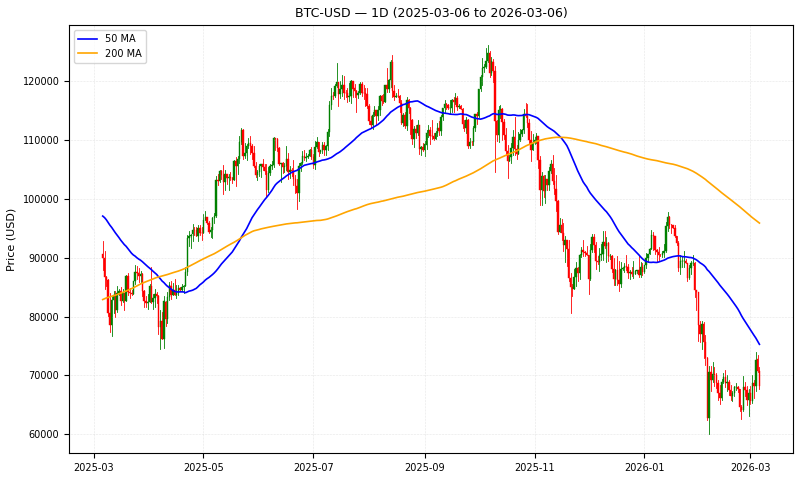

# Crypto Signal Station

A cryptocurrency and stock market signal pipeline that fetches OHLCV data, calculates technical indicators, generates buy/sell signals, and visualizes results — including output to an E Ink display on Raspberry Pi.

## Features

- Downloads OHLCV data from Yahoo Finance for 9 crypto pairs and 200+ stocks
- Stores all data in **Parquet format** across multiple timeframes (1d, 2d, 3d, 1wk, 2wk)
- Calculates RSI, MFI, Stochastic RSI, Bollinger Bands, MACD, and 50/200-day MAs
- Labels signals: `Excellent Buy`, `Great Buy`, `Good Buy`, `Excellent Sell`, `Great Sell`, `Good Sell`, `Hold`
- Forecasts future prices using Facebook Prophet
- Generates daily signal summaries for crypto and stocks
- Renders candlestick charts and bull/bear grid displays on an **800×480 E Ink screen** (Raspberry Pi)
- Publishes a static HTML site with interactive Plotly history charts
- Discord bot integration for signal alerts

## Supported Assets

**Crypto:** BTC, ETH, ADA, XRP, LTC, SOL, DOGE, HBAR, XLM

**Stocks:** 200+ symbols including AAPL, MSFT, AMZN, NVDA, TSLA, META, GOOGL, JPM, and more

## Data Storage

All data is stored as Parquet files under `crypto_history_csv/`:

```
crypto_history_csv/
├── crypto/
│   ├── 1d/   {SYMBOL}.parquet + {SYMBOL}_with_signals.parquet
│   ├── 2d/
│   ├── 3d/
│   ├── 1wk/
│   └── 2wk/
└── stocks/
    ├── 1d/
    ├── 2d/
    ├── 3d/
    ├── 1wk/
    └── 2wk/
```

Each `_with_signals.parquet` file contains OHLCV data plus: `rsi`, `mfi`, `stoch_rsi`, `bb_upper`, `bb_lower`, `macd`, `ma_50`, `ma_200`, `is_bull`, `signal`.

## Signal Rules

Buy signals (downtrend only, `is_bull = False`):

| Signal       | RSI  | MFI  | Stoch RSI |
|-------------|------|------|-----------|
| Excellent   | < 20 | < 10 | < 0.1     |
| Great       | < 30 | < 20 | < 0.2     |
| Good        | < 40 | < 30 | < 0.3     |

Sell signals (uptrend only, `is_bull = True`):

| Signal       | RSI  | MFI  | Stoch RSI |
|-------------|------|------|-----------|
| Excellent   | > 80 | > 90 | > 0.9     |
| Great       | > 70 | > 80 | > 0.8     |
| Good        | > 60 | > 70 | > 0.7     |

## E Ink Display

Two display modes for Raspberry Pi:

- **Bull/Bear Grid** (`eink_bull_bear_grid.py`) — signal grid across all assets and timeframes
- **Candle Chart** (`eink_candle_chart.py`) — 800×480 candlestick chart with 50/200 MA overlays, rotating through all symbols

Example candle chart output:



## Requirements

- Python 3.11+
- [Poetry](https://python-poetry.org/)

Key dependencies: `yfinance`, `pandas`, `ta`, `matplotlib`, `prophet`, `plotly`, `pillow`, `pycoingecko`, `duckdb`, `discord.py`, `anthropic`

## Setup

```bash
poetry install
cp config.yml.example config.yml  # add API keys
```

## Usage

Update all data and regenerate signals:

```bash
poetry run python crypto_signal_station/crypto_signal_pipeline.py
```

Run the full refresh pipeline (data → reports → feeds → deploy):

```bash
bash refresh_all.sh
```

Generate the static history site:

```bash
poetry run python generate_history.py
```

E Ink display (Raspberry Pi):

```bash
poetry run python crypto_signal_station/eink_candle_chart.py
poetry run python crypto_signal_station/eink_bull_bear_grid.py
```

Run daily report with 5-day backfill:

```bash
poetry run python crypto_signal_station/daily_report.py --backfill 5
```
